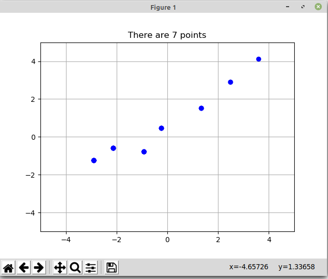
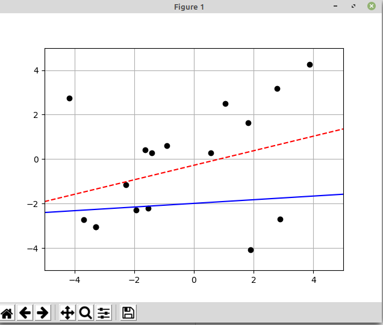

Parte 5 - SAVI
==============
Miguel Riem Oliveira <mriem@ua.pt>
2025-2026

# Sumário

- Otimização

# Exercícios

## Exercício 1 - Geração de pontos

Crie um script chamado **generate_data** que permita gerar pontos com cliques do utilizador num sistema cartesiano com as dimensões $x \in [-10, 10]$ e $y \in [-5, 5]$.
Utilize o [matplotlib](https://matplotlib.org/) para representar os pontos.

O programa deve terminar quando se pressionar a tecla ESC, e gravar os pontos recolhidos para um dicionário  $\left\lbrace\text{'xs':} [x_0,x_1, x_2, ..., x_n] , \text{'ys':} [y_0,y_1, y_2, ..., y_n]\right\rbrace$.

No final do script, este dicionário deve ser gravado para ficheiro usando a biblioteca [json](https://docs.python.org/3/library/json.html).

## Exercício 2 - Random Line Fitting

Crie um script que carregue o ficheiro de pontos definido anteriormente, e defina o modelo de uma reta, $y = m \cdot x + b$.

Os parâmetros da reta $m$ e $b$ deverão ser sorteados em cada iteração e a reta novamente desenhada (linha a azul).

Calcule o erro $\displaystyle\sum_{i=0}^n (y_{i} - y_{i}^{'})$, onde $y^{'}$ é o valor _ground truth_ dado pelos pontos do ficheiro, e $y$ é o valor obtido com base na reta.

## Exercício 3 - SciPy Line Fitting

O objetivo é utilizar a função [least squares da biblioteca scipy](https://docs.scipy.org/doc/scipy/reference/generated/scipy.optimize.least_squares.html) para encontrar os parâmetros da reta "que passa" pelos pontos definidos previamente.

Esta função deve substituir a geração aleatória dos parâmetros da reta.

## Exercício 4 - Composed model fitting

Crie um modelo composto por uma reta para valores de $x \in ]-\inf, 0]$, e por uma parábola para valores de $x \in ]0,  +\inf]$. Faça a otimização do modelo, primeiro de forma aleatória, depois com a função de least squares do scipy.